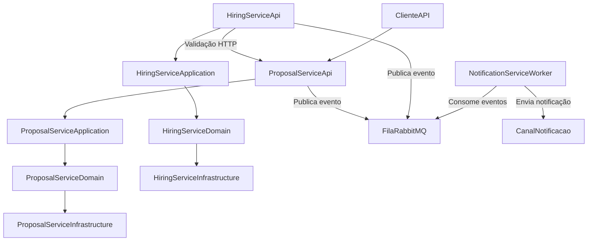

# Insurance Platform

Sistema de microserviços para gestão de seguros, desenvolvido em .NET 8, com arquitetura hexagonal, DDD, Clean Code e SOLID. A solução é composta por três domínios principais: Propostas, Contratações e Notificações, cada um com sua própria estrutura e responsabilidades.

---

## 🏗️ Arquitetura

- **Hexagonal (Ports & Adapters):** Separação clara entre domínio, aplicação, infraestrutura e API.
- **DDD:** Entidades ricas, Value Objects, Domain Services.
- **SOLID:** Classes e interfaces coesas e extensíveis.
- **Clean Code:** Nomes claros, métodos pequenos, tratamento de exceções.

### Diagrama Simplificado



---

## 🛠️ Tecnologias

- .NET 8
- PostgreSQL
- Entity Framework Core
- Docker & Docker Compose
- Swagger/OpenAPI
- xUnit, FluentAssertions, Moq (Testes)
- RabbitMQ/Kafka (Mensageria)

---

## 📋 Pré-requisitos

- [.NET 8 SDK](https://dotnet.microsoft.com/download/dotnet/8.0)
- [Docker](https://www.docker.com/get-started)
- [PostgreSQL](https://www.postgresql.org/download/)
- [RabbitMQ](https://www.rabbitmq.com/download.html) ou [Kafka](https://kafka.apache.org/quickstart)

---

## 🚀 Como Executar

### Com Docker Compose (Recomendado)

A plataforma já inclui um arquivo `docker-compose.yml` que provisiona todos os serviços necessários:
- Um único container PostgreSQL (`insurence-postgres`) para toda a plataforma, com o banco `insurence_db`.
- RabbitMQ para mensageria.
- Todos os microserviços .NET (ProposalService, HiringService, NotificationService.Worker) já configurados para rodar migrations automaticamente ao iniciar.

Para subir toda a solução:

```bash
git clone https://github.com/rizidorio/insurance-platform.git
cd insurance-platform
docker-compose up --build
```

- ProposalService: http://localhost:5001
- HiringService: http://localhost:5002
- NotificationService.Worker: executado em background (logs no console)
- RabbitMQ: http://localhost:15672 (default)
- PostgreSQL: Host `insurence-postgres`, porta `5432`, banco `insurence_db`, usuário `postgres`, senha `postgres`

### Execução Local (manual)

1. Inicie os bancos e mensageria:
```bash
docker run --name insurence-postgres -e POSTGRES_PASSWORD=postgres -e POSTGRES_DB=insurence_db -p 5432:5432 -d postgres:15-alpine
docker run -d --hostname rabbitmq --name rabbitmq -p 5672:5672 -p 15672:15672 rabbitmq:3-management
```
2. Execute as migrations:
```bash
cd src/proposalService/src/ProposalService.Infrastructure
dotnet ef database update
cd ../../../hiringService/src/HiringService.Infrastructure
dotnet ef database update
cd ../../../notificationService/src/NotificationService.Infrastructure
dotnet ef database update
```
3. Execute os serviços:
```bash
# Terminal 1
cd src/proposalService/src/ProposalService.Api
dotnet run --urls "http://localhost:5001"
# Terminal 2
cd src/hiringService/src/HinringService.Api
dotnet run --urls "http://localhost:5002"
# Terminal 3
cd src/notificationService/src/NotificationService.Worker
dotnet run
```

---

## 🧪 Testes

- Todos os testes:
```bash
dotnet test
```
- Testes específicos:
```bash
cd src/proposalService/test/Proposal.Tests
dotnet test
cd ../../../hiringService/test/Hiring.Tests
dotnet test
cd ../../../notificationService/test/NotificationService.Tests
dotnet test
```
- Com cobertura:
```bash
dotnet test /p:CollectCoverage=true
```

- Testes cobrem:
  - Regras de negócio (validação de CPF, valores, status)
  - Casos de uso (criação, aprovação, rejeição, contratação)
  - Integração entre microserviços (mock de HTTP e mensageria)
  - Persistência (mock de repositórios)
  - Processamento de eventos no NotificationService.Worker

---

## 📡 Mensageria

- **RabbitMQ/Kafka:** Utilizado para comunicação assíncrona entre serviços.
- **NotificationService.Worker:** Consome eventos de contratação/proposta e envia notificações (e-mail, SMS, push).
- Configuração de conexão nos arquivos `appsettings.json` dos serviços.
- Exemplo de evento: Contratação realizada → mensagem publicada → NotificationService.Worker consome e envia notificação.

---

## 🔄 Fluxo de Negócio

1. Cliente cria proposta (status: Em Análise)
2. Proposta é analisada (Aprovada/Rejeitada)
3. Criação da proposta gera evento na fila (Aprovação/Rejeição)
4. NotificationService.Worker consome evento e envia notificação
5. Apenas propostas aprovadas podem ser contratadas
6. HiringService valida status via HTTP antes de contratar
7. Contratação gera evento na fila
8. NotificationService.Worker consome evento e envia notificação
9. Número de apólice gerado automaticamente

---

## 🔒 Regras de Negócio

### ProposalService

- CPF: 11 dígitos, válido
- Valor do prêmio: > R$ 100,00 e < R$ 100.000,00
- Status só muda se "Em Análise"
- Não pode aprovar/rejeitar duas vezes

### HiringService

- Só contrata propostas "Aprovada"
- Número de apólice único e gerado automaticamente

### NotificationService.Worker

- Processa eventos de contratação/proposta
- Envia notificações conforme tipo de evento
- Implementado como Worker Service (.NET 8, BackgroundService)
- Dependências principais:
  - Microsoft.Extensions.Hosting (8.0.1)
  - Microsoft.EntityFrameworkCore.Design (9.0.9)
  - Integração com NotificationService.Infrastructure

---

## 🗂️ Estrutura do Projeto

```
insurance-platform/
├── src/
│   ├── proposalService/
│   │   ├── src/
│   │   │   ├── ProposalService.Api/
│   │   │   ├── ProposalService.Application/
│   │   │   ├── ProposalService.Domain/
│   │   │   └── ProposalService.Infrastructure/
│   │   └── test/
│   │       └── Proposal.Tests/
│   ├── hiringService/
│   │   ├── src/
│   │   │   ├── HinringService.Api/
│   │   │   ├── HiringService.Application/
│   │   │   ├── HiringService.Domain/
│   │   │   └── HiringService.Infrastructure/
│   │   └── test/
│   │       └── Hiring.Tests/
│   ├── notificationService/
│   │   ├── src/
│   │   │   ├── NotificationService.Worker/
│   │   │   ├── NotificationService.Application/
│   │   │   ├── NotificationService.Domain/
│   │   │   └── NotificationService.Infrastructure/
│   │   └── test/
│   │       └── NotificationService.Tests/
│   └── shared/
│       └── Insurence.Platform.Common/
├── docker-compose.yml
└── README.md
```

---

## 🐛 Troubleshooting

- **Banco de dados:** Verifique se PostgreSQL está rodando, credenciais em `appsettings.json`, execute migrations.
- **Mensageria:** Verifique se RabbitMQ/Kafka está rodando, credenciais e host em `appsettings.json`.
- **Comunicação:** Verifique URLs dos serviços, use nomes de serviço no Docker.
- **Porta em uso:** Finalize processos conforme sistema operacional.

---

## 👥 Autor

Ricardo Izidorio - [GitHub](https://github.com/rizidorio)

## 📄 Licença

MIT
